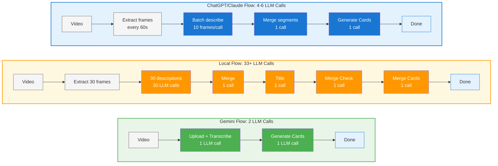

<div align="center">
  
</div>

<div align="center">
  <em>Dayflow is a private, automatic timeline of your day.</em><br>
  Stop guessing where your time went. Dayflow watches your screen and builds a detailed timeline of your day. Private and open‑source. Nothing leaves your Mac.
</div>

<div align="center">
  <!-- Badges -->
  
  
  
  
</div>

<div align="center">
  
</div>

<div align="center">
  <a href="https://github.com/JerryZLiu/Dayflow/releases/latest">
    
  </a>
</div>

<p align="center">
  <a href="#quickstart">Quickstart</a> •
  <a href="#why-dayflow">Why Dayflow</a> •
  <a href="#how-people-get-value">How people get value</a> •
  <a href="#features">Features</a> •
  <a href="#how-it-works">How it works</a> •
  <a href="#installation">Installation</a> •
  <a href="#data--privacy">Data & Privacy</a> •
  <a href="#automation">Automation</a> •
  <a href="#debug--developer-tools">Debug & Developer Tools</a> •
  <a href="#contributing">Contributing</a>
</p>

---

## What is Dayflow?

Dayflow is a **native macOS app** (SwiftUI) that watches your screen, analyzes it with AI, and generates a **timeline** of your activities with summaries.
It's lightweight (25MB app size) and uses ~100MB of RAM and <1% cpu. 

> _Privacy‑minded by design_: You choose your AI provider. Use **Gemini** (bring your own API key), **local models** (Ollama / LM Studio), or **ChatGPT/Claude** (requires paid subscription). See **Data & Privacy** for details.


## Why Dayflow

Most time trackers only log app usage. Dayflow understands context - the difference between "researching on YouTube" and "watching cat videos" - so your timeline reflects real work, not just which window was open.

It's fully open‑source and extensible: inspect the codebase, audit how data is handled, and build it yourself for maximum security.

## How people get value

- **Founders:** See where days disappear, balance maker vs. manager time, and spot hidden context switching.
- **Engineers:** Verify what really shipped, generate a standup recap in minutes, and reduce interruption drag.
- **Students:** Make study sessions visible, reduce distraction drift, and build better routines.
- **AI researchers:** See where time actually went across experiments vs. reading vs. coding, and tighten your research loop.
- **Marketing:** Track time by campaign/channel, protect creative blocks, and cut hidden ops overhead.
- **Sales:** Make calls, follow‑ups, and CRM time visible; prep pipeline recaps fast.
- **Freelancers:** Generate client‑ready summaries, show proof of work, and catch scope creep early.


---

## Features

- **Automatic timeline** of your day with concise summaries.
- **Context‑aware tracking** - more than app usage; understands what you were doing.
- **Extraordinarily battery‑efficient** by design - stays out of your way.
- **Watch timelapses of your day**.
- **Distraction highlights** to see what pulled you off‑task.
- **Timeline export** - export your timeline as Markdown for any date range.
- **Full-text search** with OCR text extraction — find any moment by searching text visible on screen.
- **Local‑first privacy** - data stays on your Mac; choose your AI provider.
- **Open‑source & extensible** - inspect the codebase or build it yourself.
- **Native UX** built with **SwiftUI**.
- **Automatic storage cleanup** with configurable limits.

### Search

Find any moment from your timeline by searching for text visible on screen.

<div align="center">
  
</div>

- **Full-text search** — SQLite FTS5-powered search across all captured text.
- **OCR text extraction** — Vision framework automatically extracts text from screenshots.
- **App context** — Search includes app names, window titles, and browser URLs.
- **Visual highlighting** — Matched text regions highlighted on screenshots.
- **Quick access** — ⌘K keyboard shortcut for instant search.
- **Detail view** — Full screenshot with metadata, quick actions (Open Image, Show in Finder, Open URL).

> **Note:** Search feature is available in this fork. OCR processing runs in the background without impacting recording performance.

### Daily Journal `BETA`

Set intentions, reflect on your day, and get AI-generated summaries of your activity.

<div align="center">
  
</div>

- **Morning intentions** - plan what you want to accomplish.
- **Evening reflections** - review how your day actually went.
- **AI summaries** - get auto-generated insights from your timeline.
- **Scheduled reminders** - configurable notifications for intentions and reflections.
- **Weekly view** - see patterns across your week.

> **Note:** Journal is currently in beta with limited access. Enter your access code in the app to unlock it.

### Coming soon

- **Dashboard (beta - ChatGPT/Claude only)** - ask any question about your workday, pipe the answers into tiles you arrange yourself, and track trends over time.

  <div align="center">
    
  </div>

## How it works

1) **Capture** - Watches your screen in lightweight chunks.
2) **Analyze** - Periodically sends recent activity to your chosen AI provider.
3) **Generate** - AI creates timeline cards with activity summaries.
4) **Display** - Shows your day as a visual timeline.
5) **Cleanup** - Auto-manages storage based on your configured limits (1GB–20GB or unlimited).

### AI Processing Pipeline

The efficiency of your timeline generation depends on your chosen AI provider:



**Gemini** leverages native video understanding for direct analysis. **Local models** reconstruct understanding from individual frame descriptions. **ChatGPT/Claude** uses CLI tools to batch-process extracted frames with frontier reasoning models - balancing quality and efficiency.


---

## Quickstart

**Download (end users)**
1. Grab the latest `Dayflow.dmg` from **GitHub Releases**.
2. Open the app; grant **Screen & System Audio Recording** when prompted:  
   macOS → **System Settings** → **Privacy & Security** → **Screen & System Audio Recording** → enable **Dayflow**.

<div align="center">
  <a href="https://github.com/JerryZLiu/Dayflow/releases/latest">
    
  </a>
</div>

**Build from source (developers)**
1. Install **Xcode 15+** and open `Dayflow.xcodeproj`.
2. Run the `Dayflow` scheme on macOS 13+.
3. In your Run **scheme**, add your `GEMINI_API_KEY` under _Arguments > Environment Variables_ (if using Gemini).

---

## Installation

### Requirements
- macOS **13.0+**
- Xcode **15+**
- A **Gemini API key** (if using Gemini): https://ai.google.dev/gemini-api/docs/api-key

### From Releases
1. Download `Dayflow.dmg` and drag **Dayflow** into **Applications**.
2. Launch and grant the **Screen & System Audio Recording** permission.

<div align="center">
  <a href="https://github.com/JerryZLiu/Dayflow/releases/latest">
    
  </a>
</div>

### From source
```bash
git clone https://github.com/JerryZLiu/Dayflow.git
cd Dayflow
open Dayflow.xcodeproj
# In Xcode: select the Dayflow target, configure signing if needed, then Run.
```

### Homebrew

If you are using [Homebrew](https://brew.sh/), you can install [Dayflow](https://formulae.brew.sh/cask/dayflow) with:

```bash
$ brew install --cask dayflow
```

---

## Data & Privacy

This section explains **what Dayflow stores locally**, **what leaves your machine**, and **how provider choices affect privacy**.

### Data locations (on your Mac)

All Dayflow data is stored in:
`~/Library/Application Support/Dayflow/`

- **Recordings (video chunks):** `Dayflow/recordings/` (or choose "Open Recordings..." from the Dayflow Taskbar Icon Menu)
- **Local database:** `Dayflow/chunks.sqlite`
- **Recording details:** Lightweight screen capture, analyzed periodically, configurable storage limits
- **Purge / reset tip:** Quit Dayflow. Then delete the entire `Dayflow/` folder to remove recordings and analysis artifacts. Relaunch to start fresh.

### Processing modes & providers
- **Gemini (cloud, BYO key)** - Dayflow sends batch payloads to **Google's Gemini API** for analysis.
- **Local models (Ollama / LM Studio)** - Processing stays **on‑device**; Dayflow talks to a **local server** you run.
- **ChatGPT / Claude (CLI-based, paid plan required)** - Dayflow drives the **Codex CLI** (ChatGPT) or **Claude Code CLI** directly on your Mac. **Requires an active ChatGPT Plus/Pro or Claude Pro subscription.** Uses frontier reasoning models for best-in-class narrative quality.

### TL;DR: Gemini data handling (my reading of Google’s ToS)
- **Short answer: There is a way to prevent Google from training on your data.** If you **enable Cloud Billing** on **at least one** Gemini API project, Google treats **all of your Gemini API and Google AI Studio usage** under the **“Paid Services”** data‑use rules - **even when you’re using unpaid/free quota**. Under Paid Services, **Google does not use your prompts/responses to improve Google products/models**.  
  - Terms: “When you activate a Cloud Billing account, all use of Gemini API and Google AI Studio is a ‘Paid Service’ with respect to how Google Uses Your Data, even when using Services that are offered free of charge.” ([Gemini API Additional Terms](https://ai.google.dev/gemini-api/terms#paid-services-how-google-uses-your-data))  
  - Abuse monitoring: even under Paid Services, Google **logs prompts/responses for a limited period** for **policy enforcement and legal compliance**. ([Same Terms](https://ai.google.dev/gemini-api/terms#paid-services-how-google-uses-your-data))  
  - **EEA/UK/Switzerland:** the **Paid‑style data handling applies by default** to **all Services** (including AI Studio and unpaid quota) **even without billing**. ([Same Terms](https://ai.google.dev/gemini-api/terms#unpaid-services-how-google-uses-your-data))

**A couple useful nuances** (from docs + forum clarifications):
- **AI Studio is still free** to use; enabling billing changes **data handling**, not whether Studio charges you. ([Pricing page](https://ai.google.dev/gemini-api/docs/pricing))  
- **UI “Plan: Paid” check:** In **AI Studio → API keys**, you’ll typically see “Plan: Paid” once billing is enabled on any linked project (UI may evolve).  
- **Free workaround:** _“Make one project paid, keep using a free key elsewhere to get the best of both worlds.”_ The **Terms** imply **account‑level** coverage once any billing account is activated, but the **Apps** nuance above may limit this in specific UI contexts. **Treat this as an interpretation, not legal advice.**

### Local mode: privacy & trade‑offs
- **Privacy:** With **Ollama/LM Studio**, prompts and model inference run on your machine. LM Studio documents full **offline** operation once models are downloaded.
- **Quality/latency:** Local open models are improving but **can underperform** cloud models on complex summarization.
- **Power/battery:** Local inference is **GPU‑heavy** on Apple Silicon and will drain battery faster; prefer **plugged‑in** sessions for long captures.
- **Future:** We may explore **fine‑tuning** or distilling a local model for better timeline summaries.

References:
- LM Studio offline: https://lmstudio.ai/docs/app/offline
- Ollama GPU acceleration (Metal on Apple): https://github.com/ollama/ollama/blob/main/docs/gpu.md

### ChatGPT/Claude mode: privacy & trade‑offs
- **Privacy:** Your screen data is processed by OpenAI (ChatGPT) or Anthropic (Claude) depending on which CLI you configure. Review their respective privacy policies.
- **Quality:** Frontier reasoning models provide the highest quality narratives and summaries.
- **Subscription required:** You **must have an active paid subscription** (ChatGPT Plus/Pro at $20+/month, or Claude Pro at $20/month). The CLI tools authenticate through your existing subscription.
- **Setup:** Requires installing the [Codex CLI](https://github.com/openai/codex) or [Claude Code](https://docs.anthropic.com/en/docs/claude-code) and staying signed in.
- **Internet:** Requires an active internet connection (no offline mode).

### Permissions (macOS)
To record your screen, Dayflow requires the **Screen & System Audio Recording** permission. Review or change later at:  
**System Settings → Privacy & Security → Screen & System Audio Recording**.  
Apple’s docs: https://support.apple.com/guide/mac-help/control-access-screen-system-audio-recording-mchld6aa7d23/mac

---

## Configuration

- **AI Provider**
  - Choose **Gemini** (set API key), **Local** (Ollama/LM Studio), or **ChatGPT/Claude** (install CLI + paid subscription).
  - For Gemini keys: https://ai.google.dev/gemini-api/docs/api-key
  - For ChatGPT: Install [Codex CLI](https://github.com/openai/codex), sign in with your **ChatGPT Plus/Pro** account
  - For Claude: Install [Claude Code](https://docs.anthropic.com/en/docs/claude-code), sign in with your **Claude Pro** account
- **Capture settings**
  - Start/stop capture from the main UI. Use **Debug** to verify batch contents.
- **Data locations**
  - See **Data & Privacy** for exact paths and a purge tip.

---

## Automation

Dayflow registers a `dayflow://` URL scheme so you can trigger common actions from Shortcuts, hotkey launchers, or scripts.

**Supported URLs**
- `dayflow://start-recording` - enable capture (no-op if already recording)
- `dayflow://stop-recording` - pause capture (no-op if already paused)

**Quick checks**
- From Terminal: `open dayflow://start-recording` or `open dayflow://stop-recording`
- In Shortcuts: add an **Open URLs** action with either link above

Deeplink-triggered state changes are logged as `reason: "deeplink"` in analytics so you can distinguish automations from manual toggles.

---

## Debug & Developer Tools

You can click the Dayflow icon in the menu bar and view the saved recordings

## Project structure

```
Dayflow/
├─ Dayflow/                 # SwiftUI app sources (timeline UI, debug UI, capture & analysis pipeline)
├─ docs/                    # Appcast and documentation assets (screenshots, videos)
├─ scripts/                 # Release automation (DMG, notarization, appcast, Sparkle signing, one-button release)
```

---

## Troubleshooting

- **Screen capture is blank or fails**  
  Check System Settings → Privacy & Security → **Screen & System Audio Recording** and ensure **Dayflow** is enabled.
- **API errors**  
  Go into settings and verify your `GEMINI_API_KEY` and network connectivity.

---

## Roadmap

- [ ] V1 of the Dashboard (track answers to custom questions)
- [x] V1 of the daily journal - _now in beta!_
- [ ] Fine-tuning a small VLM for improved local model quality 

---

## Contributing

PRs welcome! If you plan a larger change, please open an issue first to discuss scope and approach.  

---

## License

Licensed under the MIT License. See LICENSE for the full text.
Software is provided “AS IS”, without warranty of any kind.

---

## Acknowledgements

- [Sparkle](https://github.com/sparkle-project/Sparkle) for battle‑tested macOS updates.
- [Google AI Gemini API](https://ai.google.dev/gemini-api/docs) for analysis.
- [Ollama](https://ollama.com/) and [LM Studio](https://lmstudio.ai/) for local model support.
- [OpenAI Codex CLI](https://github.com/openai/codex) and [Claude Code](https://docs.anthropic.com/en/docs/claude-code) for CLI-based inference.
